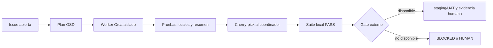

# Phase 3 — Resumen de ejecución y auditoría

## Resultado

Los seis planes de la fase se ejecutaron en worktrees hijos Orca, en dos waves
y sin subdelegación. Los cambios fueron revisados e integrados en el worktree
coordinador. La fase queda **verificada localmente**; no se marca como
cierre total porque Railway, staging, CI remoto, credenciales autorizadas,
UAT autenticado y la toma física de evidencias no ocurrieron.

## Delegación e integración

| Plan | Worker Orca | Proveedor | Commit integrado en el padre |
|---|---|---|---|
| 03-01 | `ctx_97b2c1baaa51` | Codex | `217aff2` |
| 03-02 | `ctx_269eb7fc9ed6` | Claude | `1b26ea9` |
| 03-03 | `ctx_c96044deac25` | Claude | `1afc964` |
| 03-04 | `ctx_1d622d475c78` | Codex | `ea9a2ac` |
| 03-05 | `ctx_71d791ecf2f1` | Claude | `fded28e` (child `95c994b`) |
| 03-06 | `ctx_77ef876d7673` | Codex | `ec2e995` (child `7f4a45b`) |

Cada especificación de worker indicó explícitamente: no crear otra Run, no
delegar subagentes, no escribir en Linear y no hacer push. Los workers
reclamables fueron liberados al terminar; el worktree marcado `user_owned` y
los worktrees históricos se conservaron. El primer intento de 03-06 partió de
una base obsoleta, fue detenido y liberado sin integrar cambios; el reemplazo
se creó desde `c1162db` de la rama padre y fue el que produjo `7f4a45b`.

## Correcciones integradas

- Runner MySQL con polling de readiness, timeout acotado, secreto fuera de
  argumentos/logs y cleanup de contenedor/archivo temporal; Compose monta
  `BD/SGI_SENA.sql`.
- `iniciarUsoAutoservicio` ya no ejecuta DDL ni `INFORMATION_SCHEMA` en el
  request path y falla cerrado con `503` cuando el boot no dejó readiness.
- Autoservicio con límites independientes por IP y por identificador
  documento+placa normalizado y hasheado; `registro-externo` queda parcial
  hasta decisión formal de identidad/capability/cuota.
- Validación OLE/ZIP de Excel antes del parser, rutas importadoras
  fail-closed, contratos E2E públicos, smoke de solo lectura y test de sesión
  alineado con cookies `httpOnly`.
- Se aislaron mocks de Multer entre suites y se limpiaron tres errores de lint
  heredados para que el gate global sea interpretable.
- MDL-13: `GET /:codigo/uso/historial` ahora conserva la consulta amplia de
  Admin/Instructor/Cuentadante y aplica alcance fail-closed al Aprendiz:
  identidad válida, vínculo activo en `Responsables_Equipo` y solo su propio
  `Historial_Uso_Equipos`; vínculo ausente responde 404 no enumerable.
- MDL-13: las lecturas de detalle, verificaciones y movimientos que aceptan
  `VIEW_OWN` ahora exigen identidad positiva y vínculo activo antes de devolver
  información; detalle filtra responsables ajenos y los tres roles amplios
  conservan su visibilidad.

## Evidencia local

```text
Backend completo: 97 suites PASS de 98; 1 suite skipped; 2.011 tests PASS y 7 skipped.
Backend focal MDL-13: 3 suites, 228/228 tests PASS; `equiposController.test.js` 149/149.
Backend focal importación/Excel: 40/40 tests PASS.
Backend focal lint heredado: 41/41 tests PASS.
Backend lint: 0 errores, 400 warnings.
Frontend completo: 10 archivos, 33/33 tests PASS.
Frontend hook de imágenes: 2/2 tests PASS.
Frontend build: PASS; solo warning de tamaño de chunk.
Frontend lint: 0 errores, 100 warnings.
Playwright Chromium: 3/3 specs PASS, sin credenciales ni mutaciones.
MySQL 8 real: 7/7 tests PASS; no quedaron contenedores temporales.
Runner MySQL determinista: 4/4 tests PASS.
Readiness/DDL: 3 suites, 21/21 tests PASS.
Rate limits: 2 suites, 18/18 tests PASS.
docker compose config: PASS, con warnings por variables externas vacías y version obsoleto.
git diff --check: PASS.
```

## Coherencia de estado y evidencia



La evidencia local respalda correcciones de código y contratos públicos. No se
usa como sustituto de despliegue, CI, prueba autenticada o verificación física.

## Estado por issue

| Issue | Estado de código local | Evidencia o bloqueo restante |
|---|---|---|
| MDL-13 | PASS local focal/global | Prueba real con datos controlados y limpieza/anonimización requieren entorno autorizado; Railway/UAT autenticado pendientes |
| MDL-11 | PASS local | Login autenticado desplegado, evidencia visual y UAT pendientes |
| MDL-14 | PASS local seguro | Pentest/staging controlado pendiente; no se ejecutó DoS |
| MDL-15 | PARCIAL | Faltan gates de staging/negativos autorizados y evidencia física 303/304 |
| MDL-73 | PASS local | Validación del despliegue no ejecutada |
| MDL-126 | PARCIAL | `registro-externo` requiere política de identidad, API key/firma/capability y cuota |
| MDL-129 | PASS local | Railway/clean deployment pendiente |
| MDL-130 | PASS local | Revisión en despliegue pendiente |
| MDL-135 | PASS local | CI y E2E autenticado desplegado pendientes |
| MDL-138 | PASS local con MySQL 8 | Railway/staging y concurrencia de arranque desplegada pendiente |

## Decisión de cierre

MDL-154 permanece en el estado de Linear que tenía (`Todo`). El cambio de
estado no se promueve mientras falten las evidencias externas, y las tareas de
toma física de aulas 303/304 quedan explícitamente fuera de esta ejecución.
